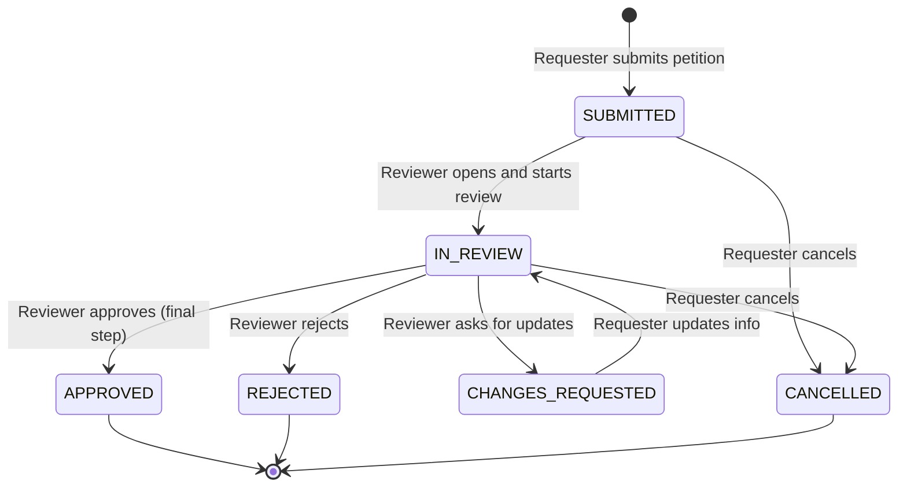
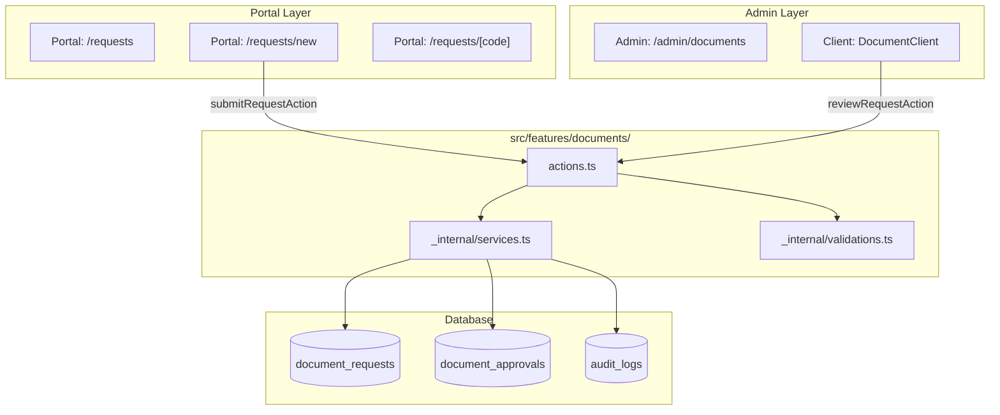

# Architecture: Document & Workflow Management

## Component Hierarchy & Workflow State Machine

```mermaid
stateDiagram-v2
    [*] --> SUBMITTED: Requester submits petition
    SUBMITTED --> IN_REVIEW: Reviewer opens and starts review
    IN_REVIEW --> APPROVED: Reviewer approves (final step)
    IN_REVIEW --> REJECTED: Reviewer rejects
    IN_REVIEW --> CHANGES_REQUESTED: Reviewer asks for updates
    CHANGES_REQUESTED --> IN_REVIEW: Requester updates info
    SUBMITTED --> CANCELLED: Requester cancels
    IN_REVIEW --> CANCELLED: Requester cancels
    APPROVED --> [*]
    REJECTED --> [*]
    CANCELLED --> [*]
```

## System Flow

```mermaid
flowchart TD
    subgraph Portal Layer
        MyRequestsPage["Portal: /requests"]
        NewRequestPage["Portal: /requests/new"]
        RequestDetailPage["Portal: /requests/[code]"]
    end

    subgraph Admin Layer
        AdminDocsPage["Admin: /admin/documents"]
        DocumentClient["Client: DocumentClient"]
    end

    subgraph Feature Layer ["src/features/documents/"]
        Actions["actions.ts"]
        Services["_internal/services.ts"]
        Validations["_internal/validations.ts"]
    end

    subgraph Database
        DocReq[(document_requests)]
        DocApp[(document_approvals)]
        Audit[(audit_logs)]
    end

    NewRequestPage -->|submitRequestAction| Actions
    DocumentClient -->|reviewRequestAction| Actions
    Actions --> Validations
    Actions --> Services
    Services --> DocReq
    Services --> DocApp
    Services --> Audit
```
