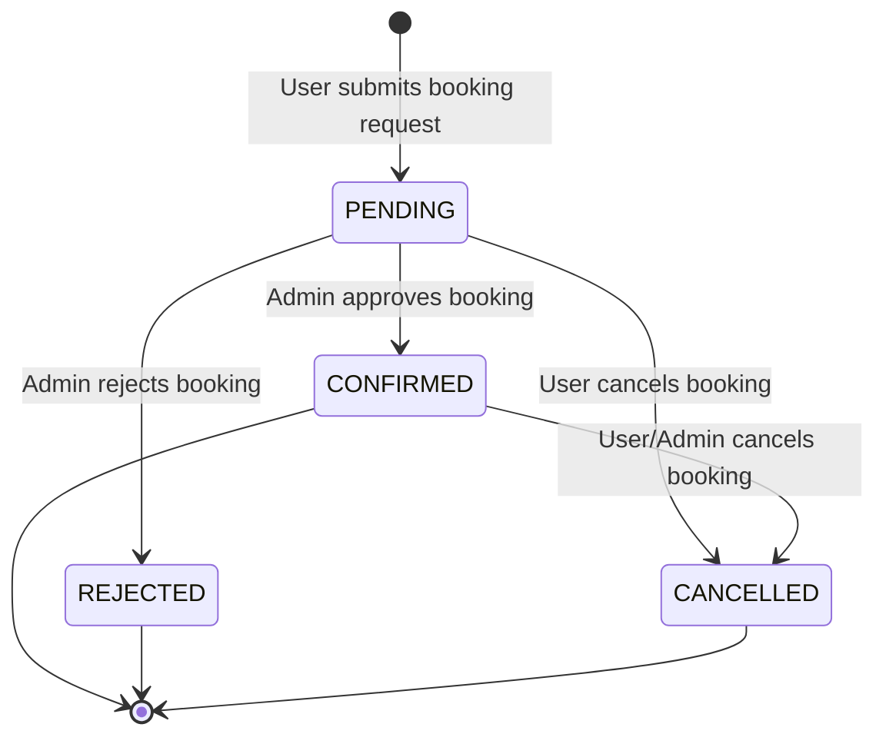
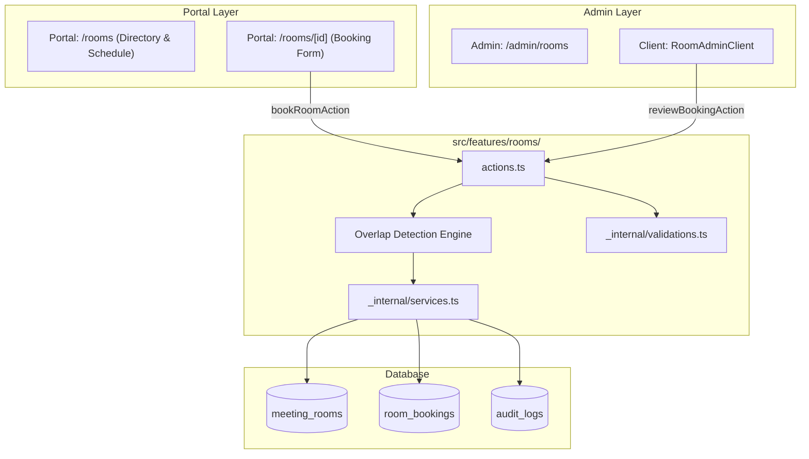

# Architecture: Faculty Meeting Room Booking

## Booking State Lifecycle & Overlap Prevention

```mermaid
stateDiagram-v2
    [*] --> PENDING: User submits booking request
    PENDING --> CONFIRMED: Admin approves booking
    PENDING --> REJECTED: Admin rejects booking
    PENDING --> CANCELLED: User cancels booking
    CONFIRMED --> CANCELLED: User/Admin cancels booking
    CONFIRMED --> [*]
    REJECTED --> [*]
    CANCELLED --> [*]
```

## System Diagram

```mermaid
flowchart TD
    subgraph Portal Layer
        RoomsPortal["Portal: /rooms (Directory & Schedule)"]
        RoomDetailPage["Portal: /rooms/[id] (Booking Form)"]
    end

    subgraph Admin Layer
        AdminRoomsPage["Admin: /admin/rooms"]
        RoomClient["Client: RoomAdminClient"]
    end

    subgraph Feature Layer ["src/features/rooms/"]
        Actions["actions.ts"]
        Services["_internal/services.ts"]
        ConflictEngine["Overlap Detection Engine"]
        Validations["_internal/validations.ts"]
    end

    subgraph Database
        Rooms[(meeting_rooms)]
        Bookings[(room_bookings)]
        Audit[(audit_logs)]
    end

    RoomDetailPage -->|bookRoomAction| Actions
    RoomClient -->|reviewBookingAction| Actions
    Actions --> Validations
    Actions --> ConflictEngine
    ConflictEngine --> Services
    Services --> Rooms
    Services --> Bookings
    Services --> Audit
```
